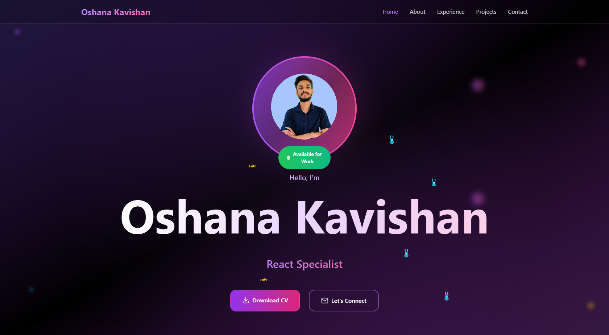

# 🚀 Modern Portfolio – Oshana Kavishan

A sleek, responsive, and animated personal portfolio built with **React**, **Vite**, and **Tailwind CSS**. It showcases my skills, projects, experience, and includes a contact form and dark mode toggle.

## 📌 Live Demo

👉 [View Live Website]([https://your-vercel-deployment-url.vercel.app](https://portfolio-oshana-kavishan.vercel.app/))  
🔗 [Download My CV](./public/my-cv.pdf)

---

## ✨ Features

- ⚡ Fully responsive design
- 🌙 Dark mode toggle
- 📁 Project showcase with GitHub + live demo links
- 🛠️ Tech stack progress bars
- 🧑 About, Experience, Skills, and Contact sections
- 📩 Working contact form with validation
- 📸 Image animations and scroll transitions
- 🎨 Tailwind CSS styling with beautiful gradients

---

## 🛠️ Built With

- [React](https://reactjs.org/)
- [Vite](https://vitejs.dev/)
- [Tailwind CSS](https://tailwindcss.com/)
- [Lucide Icons](https://lucide.dev/)
- [React Hot Toast](https://react-hot-toast.com/)
- Deployed on [Vercel](https://vercel.com/)

---

## 🤝 Let's Work Together

I'm Oshana Kavishan — passionate about building modern web and mobile applications.  
If you're interested in working together or just want to connect, feel free to reach out!

- 📧 Email: kavishansilva@gmail.com  
- 🔗 LinkedIn: [linkedin.com/in/oshana-kavishan-9ab10b23b](https://www.linkedin.com/in/oshana-kavishan-9ab10b23b)  
- 💻 GitHub: [github.com/OshanaKavishan](https://github.com/OshanaKavishan)

